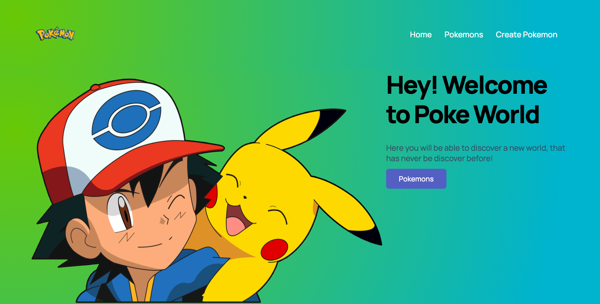

### Hello, It's me again! 👋

<!--
**Davidcastel26/Davidcastel26** is a ✨ _special_ ✨ repository because its `README.md` (this file) appears on your GitHub profile.

Here are some ideas to get you started:

- 🔭 I’m currently working on ...
- 🌱 I’m currently learning ...

- 🤔 I’m looking for help with ...
- 💬 Ask me about ...
- 📫 How to reach me: ...
-->
- 👯 I’m looking to collaborate on startups (It's a dream)
- 😄 Pronouns: He/His/Him
- ⚡ Fun fact: I like to climb volcanoes, on December 18 2021, I climbed a volcano at night unknowing the way

```js
import SoftwareDeveloper from 'Online Courses';

class Bio extends SoftwareDeveloper {
  name     = 'David Castellanos';
  title    = 'Software Engineer';
  location = 'Guatemala';
}

class Skills extends SoftwareDeveloper {
  languages  = ['JavaScript','Node JS', 'Python'];
  databases  = ['PostgreSQL','MSSQL','MYSQL'];
  frameworks = ['React', 'React Native', 'Redux', 'Express'];
  ORMs= ['Sequalize','PRISMA'];
}
```
---
### Check here one of My proyects..

[Pokemon Collector](https://github.com/Davidcastel26/PI-Pokemon-main)

---

<h3> 🤝🏻 Connect with Me </h3>

<br>


<p align="center">

<a href="https://www.linkedin.com/in/david-larios-29a8231a1/"></a>

<a href="https://www.instagram.com/david_castel26/"></a>

<a href="mailto:davcastellanoslarios@gmail.com"></a>

</p>

---

⭐️ From [@Davidcastel26](https://github.com/Davidcastel26)
